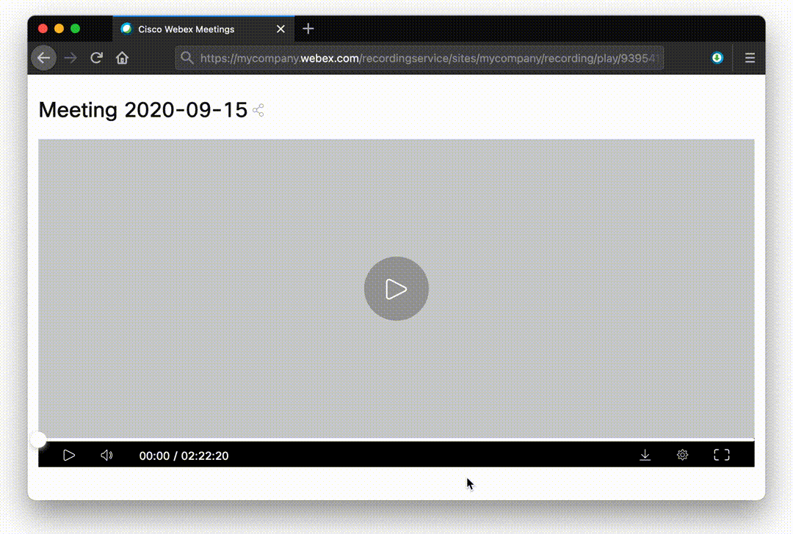

# WebXDownloader

**Developed by Abu Suraih Sakhri**

This is a browser extension that enables seamless downloading of Webex meeting recordings on **Chromium-based browsers** (Google Chrome, Microsoft Edge, Brave, etc.). It automatically adds a convenient download button straight to the video playback controls, allowing you to download the recording directly in `.mp4` format.

Additionally, it provides the direct URL to the HLS stream and allows you to save the chat transcript in JSON or plain text formats.



## Features

- 🚀 **One-Click Download**: Integrated directly into the Webex player UI.
- 💾 **Chat Transcript Export**: Save meeting chats in `.txt` or `.json` formats.
- 🎥 **HLS Stream Access**: Get the raw stream URL for use in external media players like VLC.
- 🌐 **Modern Architecture**: Fully compatible with Manifest V3 for future-proof Chromium support.

## Installation

### Google Chrome / Microsoft Edge / Brave

Since this extension is optimized for modern Chromium browsers, you can install it manually in developer mode:

1. Download or clone this repository to your local machine:

   ```bash
   git clone https://github.com/YOUR_GITHUB_USERNAME/WebXDownloader.git
   ```

2. Open your browser and navigate to the Extensions page:
   - Chrome/Brave: `chrome://extensions/`
   - Edge: `edge://extensions/`
3. Turn on **Developer mode** (usually a toggle switch located in the top right or left corner).
4. Click **Load unpacked** (or "Load unpacked extension...").
5. Select the `src` folder located inside the downloaded repository.
6. The extension is now installed and ready to use!

## Usage

Simply navigate to any Webex meeting recording page. You will find a **download icon** on the right side of the playback control bar.

If you want to copy the raw HLS stream URL or download the chat transcript separately, click on the **WebXDownloader extension icon** in your browser toolbar while viewing the recording.

---
**Disclaimer**: This tool is designed to facilitate downloading recordings that you have authorized access to. Please respect the copyright and privacy of the meeting participants and hosts.
