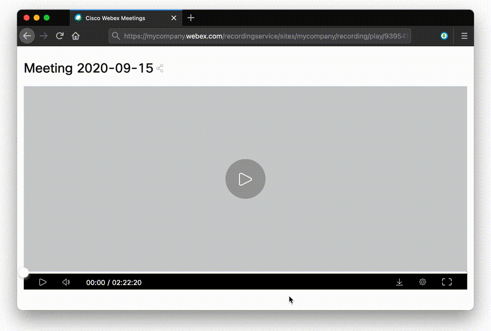

# WebXDownloader

WebXDownloader is a Manifest V3 browser extension for authorized Webex recording pages. It can start the MP4 download exposed by Webex, show the HLS stream URL, and export an available chat transcript as text or JSON.



## Features

- Adds a download control to supported Webex recording pages when an MP4 URL is available.
- Shows the HLS stream URL in a compact popup.
- Exports available recording chat data as `.txt` or `.json`.
- Uses a light interface by default with a persistent dark-mode toggle.
- Keeps recording passwords in memory only and does not persist them.

## Installation

The extension is intended for Chromium-based browsers such as Chrome, Edge, and Brave.

### Packaged release

1. Download `webxdownloader.zip` from the latest GitHub Release.
2. Extract the ZIP.
3. Open the browser's extensions page (`chrome://extensions/` or `edge://extensions/`).
4. Enable **Developer mode**.
5. Choose **Load unpacked** and select the extracted folder.

### From source

1. Clone or download this repository.
2. Open the browser's extensions page (`chrome://extensions/` or `edge://extensions/`).
3. Enable **Developer mode**.
4. Choose **Load unpacked**.
5. Select the repository's `src` directory.

No build step or package installation is required.

## Usage

Open a Webex recording playback page that you are authorized to access. WebXDownloader reads the recording metadata already available to that browser session.

- Use the download icon added near the recording header to start the MP4 download when Webex provides a direct MP4 URL.
- Open the extension popup to copy the HLS stream URL.
- If chat data is present in the recording metadata, export it as text or JSON from the popup.

Password-protected recordings must be unlocked in Webex first. The extension observes the Webex recording request header needed for that playback session and forwards the value only to the tab that originated the request.

## Permissions and privacy

The extension requests only the browser permissions needed for its workflow:

- `activeTab` to inspect the active recording tab after the extension is opened.
- `downloads` to start the recording download.
- `storage` to remember popup preferences such as theme and tip visibility.
- `webRequest` plus `https://*.webex.com/*` host access to read Webex recording metadata required by the playback page.

There is no analytics or external telemetry in the repository. Recording passwords are not written to browser storage. Exported chat files are generated locally in the browser.

## Development and validation

The extension source is in `src/`. Load that directory as an unpacked extension for manual testing.

Local validation requires Node.js 22 or newer:

```bash
node --check src/background.js
node --check src/content.js
node --check src/options.js
node --check src/popup.js
node --check src/utils.js
node tests/validate.mjs
```

The same checks run in GitHub Actions on pushes and pull requests targeting `master`. Successful versioned pushes also publish a ZIP package as a GitHub Release when that version does not already have a release.

## Compatibility and limitations

WebXDownloader depends on Webex recording page markup and recording API response fields. Webex can change those interfaces without notice, so a future Webex update may require corresponding extension changes. The extension is not a GitHub Pages application and does not require a deployed website.

Use it only for recordings that you are authorized to access and download.

## License

No license file is currently included in this repository.
